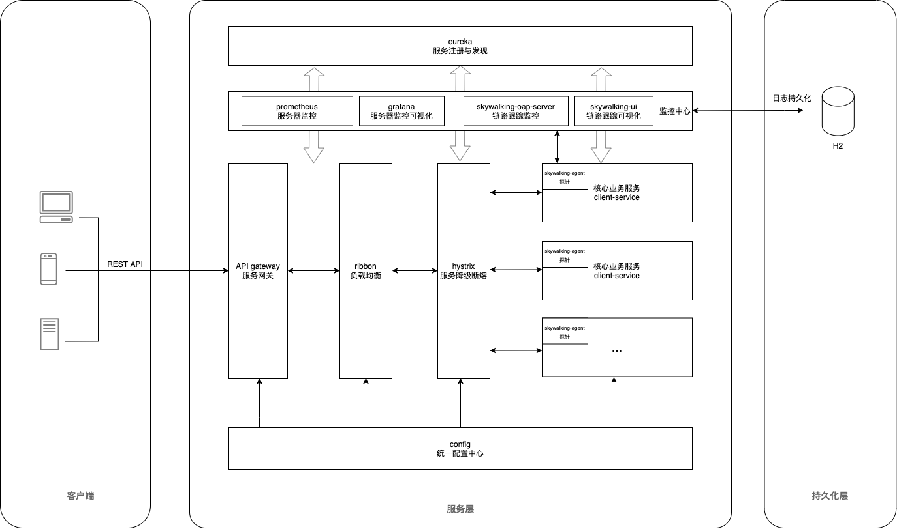
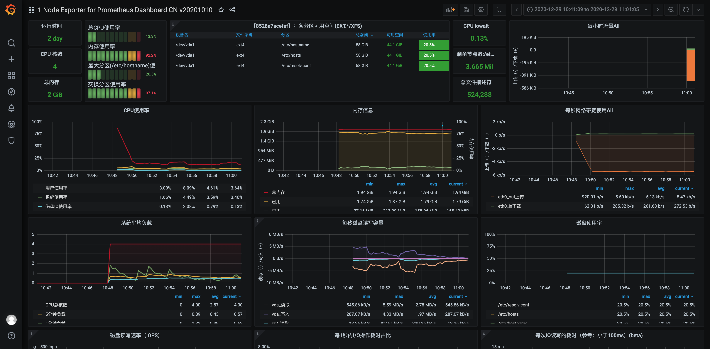
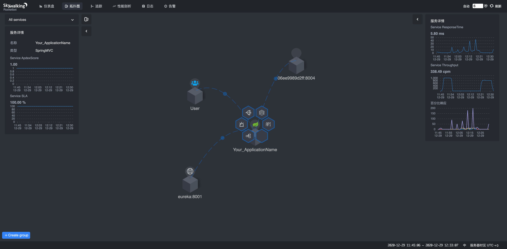
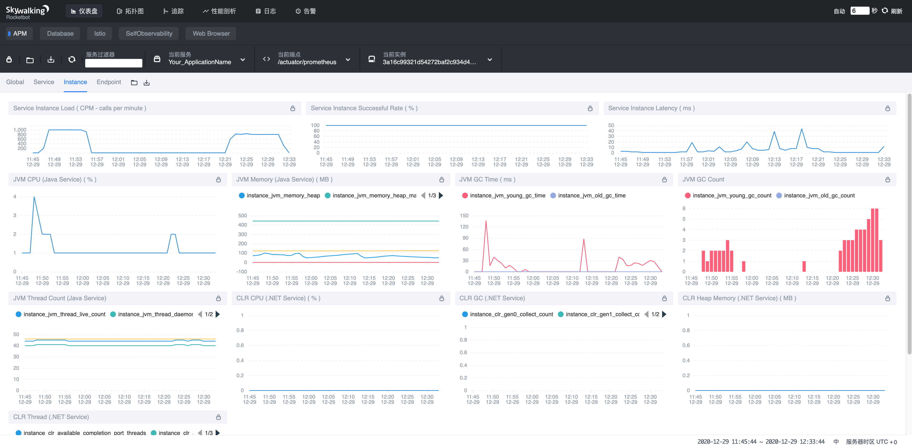

# Welcome!
## This is a SpringCloud demo with SkyWalking and Prometheus;

## 简介

demo基于Spring Cloud Greenwich, 集成了springcloud大部分核心组件, 包括Spring Cloud Eureka, Gateway, Ribbon, Hystrix, Config; 项目采用上述基础组件搭建, 并未使用Zuul, OpenFeign等集成组件, 也未使用Bus做配置自动刷新等其他特性, 未探讨Nacos, Consul等其他组件方案, 仅用以演示微服务基础架构;

## 项目架构



## 项目结构

``` lua
springcloud-demo
├── client-service -- 核心业务服务
├── common -- 公共模块
├── eureka -- 注册中心,服务注册与发现
├── config -- 配置中心服务
├── gateway -- 网关服务
├── ribbon -- 负载均衡服务
├── hystrix -- 服务降级与熔断服务
└── resources -- 第三方服务配置及中间文件
```

### 编译
```
mvn clean install -DskipTests
```

### 本地运行
- springcloud全链路服务启动
> 请确保本机端口8000,8001,8002,8003,8004,9001未被占用;

```
COMPOSE_HTTP_TIMEOUT=500 docker-compose up
```

- 简化springcloud+prometheus+skywalking
> 由于本机环境所限, 此处简化了springcloud服务集, 只保留了eureka,config,client-service用以演示prometheus+skywalking服务器监控和链路追踪; 请确保本机端口8000,8001,8004,9090,9099,11800,12800,13800未被占用; 如需查看所有服务, 请酌情修改docker-compose.yml;

```
COMPOSE_HTTP_TIMEOUT=500 docker-compose -f docker-compose-monitor.yml up
```

### 测试
- eureka服务器地址: [http://localhost:8001](http://localhost:8001)
- client-service客户端服务api文档地址: [http://localhost:8000/swagger-ui.html#/](http://localhost:8000/swagger-ui.html#/)
- 测试api全链路请求地址: [http://localhost:9001/user/1](http://localhost:9001/user/1)
- gateway服务器地址: [http://localhost:9001](http://localhost:9001)
- ribbon服务器地址: [http://localhost:8002](http://localhost:8002)
- hystrix服务器地址: [http://localhost:8003](http://localhost:8003)
- config服务器地址: [http://localhost:8004](http://localhost:8004)
- prometheus服务地址: [http://localhost:9090/classic/targets](http://localhost:9090/classic/targets)
- grafana服务地址: [http://localhost:9099/](http://localhost:9099/)
- skywalking服务地址: [http://localhost:13800/](http://localhost:13800/)

### prometheus+grafana
```
1. grafana用户名admin, 密码admin;
2. grafana中添加Prometheus DataSources, (docker环境,注意Prometheus host地址, 可用"host.docker.internal"代替"localhost");
3. Import, 上传/resourdes/grafana/system_overview.json, 创建Dashboard;
4. 还可配置监控告警pagerduty等特性, 此例暂未展示;
```
##### 运行截图


### skywalking
结合jmeter链路压测
##### 运行截图



